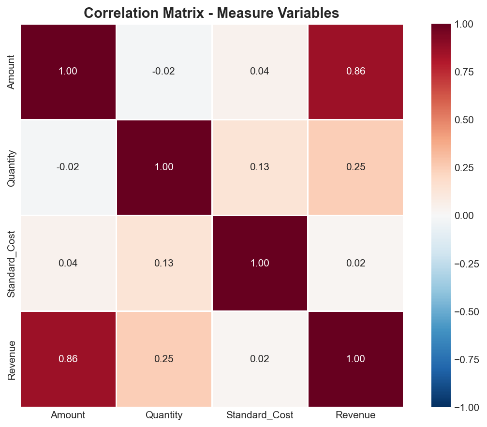
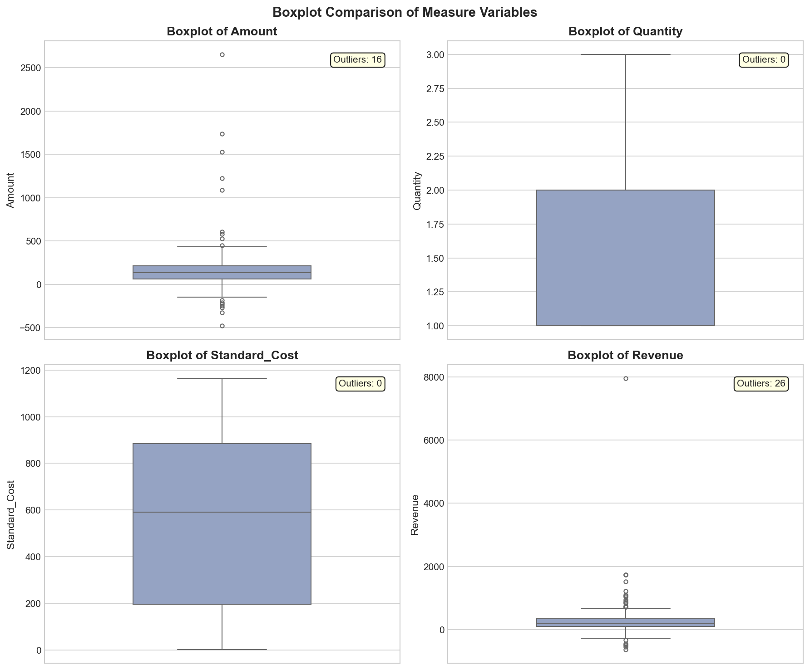
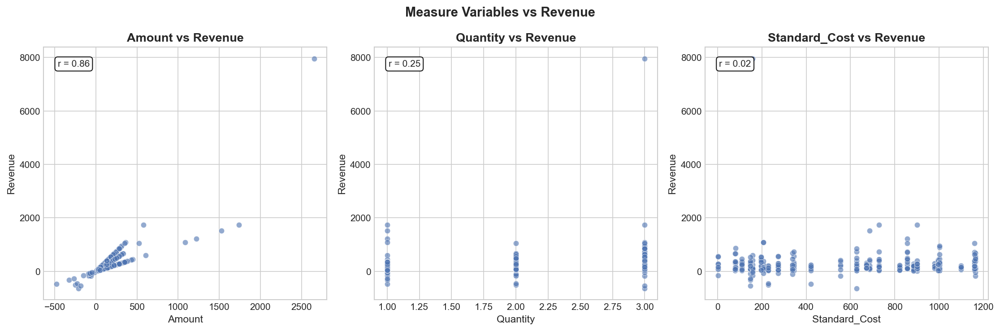

# Healthcare Visit Analysis

Exploratory data analysis of synthetic healthcare visit data, examining visit-level costs, procedures, and revenue patterns across clinics and specialties.

## Project Structure

```
healthcare-visit-analysis/
├── data/
│   ├── raw/                     # Original source data
│   └── processed/
│       └── integrated_output.csv
├── notebooks/
│   ├── 01_data_prep.ipynb       # Data cleaning and integration
│   └── 02_eda.ipynb             # Exploratory data analysis
├── results/
│   └── figures/                 # Generated visualizations
├── .gitignore
├── README.md
└── requirements.txt
```

## Dataset Overview

Each row represents a single patient visit with the following key attributes:

| Variable         | Type        | Description                       |
| ---------------- | ----------- | --------------------------------- |
| `visit_id`       | Identifier  | Unique visit identifier           |
| `patient_id`     | Identifier  | Patient identifier                |
| `clinic_id`      | Categorical | Clinic where visit occurred       |
| `procedure_code` | Categorical | Procedure identifier              |
| `procedure_name` | Categorical | Procedure description             |
| `specialty`      | Categorical | Medical specialty                 |
| `amount`         | Continuous  | Billed amount per unit            |
| `quantity`       | Discrete    | Number of units                   |
| `revenue`        | Continuous  | Total revenue (amount × quantity) |
| `standard_cost`  | Continuous  | Standard procedure cost           |
| `region_name`    | Categorical | Geographic region                 |
| `is_refund`      | Boolean     | Refund indicator                  |
| `is_outlier`     | Boolean     | Outlier flag from data prep       |

## Analysis Summary

### Univariate Findings
- **Amount & Revenue**: Highly right-skewed with extreme outliers; log transformation reveals more symmetric underlying distributions
- **Standard_Cost**: Approximately symmetric, reflecting standardized pricing tiers
- **Quantity**: Discrete, most procedures involve single units

### Bivariate Findings
- Strong correlation between Amount and Revenue (r = 0.86)
- Weak correlation between Standard_Cost and actual Amount charged (r = 0.04), suggesting pricing variability from discounts/adjustments
- Revenue varies significantly across Specialties and Procedures

## Key Visualizations

### Correlation Matrix


### Measure Variable Distributions


### Scatterplots vs Revenue


## Setup

### Requirements
```bash
pip install -r requirements.txt
```

### Running the Analysis
1. Ensure data is in `data/processed/integrated_output.csv`
2. Run notebooks in order:
   - `01_data_prep.ipynb` - Data preparation
   - `02_eda.ipynb` - Exploratory analysis

Figures are saved to `results/figures/`.

## Requirements

- Python 3.9+
- pandas >= 2.0
- numpy >= 1.24
- matplotlib >= 3.7
- seaborn >= 0.12
- scipy >= 1.10
- statsmodels >= 0.14